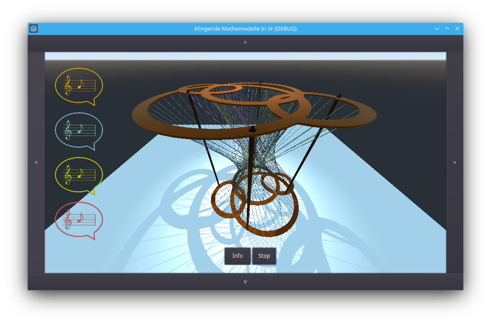

# Melodic-mathematical-models-in-VR
Mathematical models not only to look at but also for listen too - just sonified mathematical models in virtual-reality.

My project for the [Coding da Vinci-Kulturhackathon Ost³ 2022](https://codingdavinci.de/de/events/ost3-2022):  [Klingende Mathemodelle in VR](https://codingdavinci.de/de/projekte/klingende-mathemodelle-vr).

Thanks for the data providers:
* [Digitales Archiv mathematischer Modelle](https://codingdavinci.de/de/daten/digitales-archiv-mathematischer-modelle) for the cool math-stuff
* [Musikinstrumentenmuseum der Universität Leipzig](https://codingdavinci.de/de/daten/vier-musikinstrumente-aus-vier-jahrhunderten-multimodale-forschungsdaten) for the historic sounds

